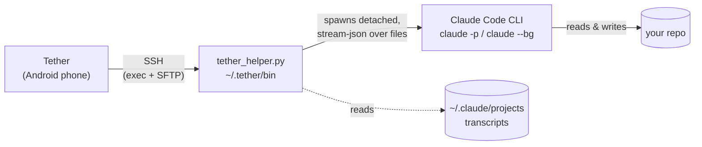

<div align="center">


# Tether

**Claude Code in your pocket.**

Start, watch, steer and approve Claude Code agents on your own machines, from your Android phone, over SSH.

[](LICENSE)
[](https://github.com/iwm911/Tether/releases/latest)
[-3DDC84?logo=android&logoColor=white)](#requirements)
[](https://kotlinlang.org)

[Download](https://github.com/iwm911/Tether/releases/latest) ·
[Website](https://iwm911.github.io/Tether/) ·
[Privacy](PRIVACY.md) ·
[Contributing](CONTRIBUTING.md)

</div>

---

Tether is an Android app for driving Claude Code from your phone. It connects over SSH to computers
you already own, so there's no Tether server and no account. Agents run detached on the machine, so
they keep working when your phone sleeps, loses signal or the app is killed. When you open the app
again it re-attaches and picks up from where it left off.

## Why

Claude Code does its best work over long runs. Those runs tend to stop and wait for you just after
you've walked away from the keyboard: *"Can I run `npm test`?"*. Tether sends that question to your
phone. You can approve it from the notification, read the diff, reply, or change course, and your
code and credentials never leave your own machines.

## Features

- **A home screen for your agents.** Agents waiting on you come first, with inline **Allow / Deny**.
  Running agents are next, with live status, their last message, elapsed time and cost. Recent
  agents are listed after that.
- **A conversation, not a terminal.** Claude's replies render as Markdown in a serif face. Tool calls
  are quiet one-line rows (`Read  src/App.kt`, `Bash  ./gradlew test`) that expand to show unified
  diffs, command output and file previews. The raw log is there if you ask for it.
- **Approvals you can reach with a thumb.** Choose *Allow once*, *Always allow `<rule>`* or *Deny*,
  and optionally tell Claude what to do instead. You can also answer from the notification (Allow,
  Deny or Reply).
- **Full control of each agent.** Interrupt with a Stop button. Tap the chip to cycle permission
  modes (Ask → Accept edits → Plan → Auto). Switch models mid-run. The composer has `/` slash-command
  autocomplete, voice dictation and image attachments. Messages sent while Claude is busy are queued.
- **Live plan and question UI.** Claude's todo list becomes a pinned checklist with progress.
  `AskUserQuestion` prompts appear as tappable choices.
- **Branch and retry.** Edit an earlier message and branch from it. You get a preview of Claude
  Code's file checkpoints first and can choose whether to restore files too.
- **Past sessions and projects.** Browse every Claude Code session on each machine, including ones
  started on the desktop, and continue any of them from the phone.
- **New agents in any folder.** Pick a machine, browse its folders (git repos are marked), choose a
  model and permission mode, and start.
- **Claude Code's own background agents.** Tether can also start and manage native `claude --bg`
  agents (see [Two kinds of agents](#two-kinds-of-agents)).
- **Built for mobile networks.** SSH keepalives, instant re-validation when the network changes or
  the app returns to the foreground, and an optional foreground service that keeps links open so
  approval requests still arrive.
- **Calm, native design.** Jetpack Compose and Material 3 with dark and light themes (following the
  system by default), optional dynamic colour, haptics and an adjustable code text size.
- **Built-in updates** from GitHub Releases, verified by SHA-256.

### Two kinds of agents

| | Live (recommended) | Background |
|---|---|---|
| Runs as | `claude -p` stream-json, driven by Tether | native `claude --bg` |
| Approve tool use from the phone | ✅ panel + notification actions | ❌ approvals happen on the computer |
| Streaming, interrupt, mode/model switch | ✅ | stop only |
| Shows in `claude agents` on the computer | — | ✅ |
| Reply | any time (queues while busy) | when it's idle/done |

## How it works



1. Tether opens an SSH connection to your machine using **sshj** and BouncyCastle.
2. On first use it uploads a small helper script over SFTP to `~/.tether/bin/tether_helper.py`
   (Python 3.6+, standard library only). It uploads it again whenever the helper version changes.
3. To start an agent, the helper spawns Claude Code **detached** (`setsid`, new session). Claude
   reads stream-json from `~/.tether/runs/<id>/in.jsonl` and writes to `out.jsonl`. The run doesn't
   depend on the SSH connection staying up.
4. The app follows `out.jsonl` from a byte offset and renders it as a conversation. Your messages,
   approvals, interrupts and mode or model changes are appended to `in.jsonl`.
5. A `watch` command streams status changes for all runs, plus a heartbeat so the app can detect
   dead links. Past sessions are read from Claude Code's own transcripts in `~/.claude/projects`.

The architecture, the verified Claude Code protocol notes and the design direction are in
[`docs/SPEC.md`](docs/SPEC.md).

## Requirements

**Phone:** Android 8.0 or newer (minSdk 26, targetSdk 35).

**Each machine you connect to:**

- An SSH server reachable from the phone (LAN, Tailscale/WireGuard, etc.)
- [Claude Code](https://docs.claude.com/en/docs/claude-code) installed and logged in
  (`claude --version` works for that user). Tether finds `claude` through a login shell and the
  usual install locations, or you can set the binary path per machine.
- `python3` (3.6+) for the helper. It uses only the standard library, so there's nothing to `pip install`.

The helper uses POSIX process groups and `fcntl`, so hosts need to be Linux or macOS.

## Install

1. Download the latest `.apk` from
   **[GitHub Releases](https://github.com/iwm911/Tether/releases/latest)**.
2. Open it on your phone. When Android asks, allow **Install unknown apps** for your browser or file
   manager.

Or, from a computer: `adb install tether-release-X.Y.Z-N.apk`.

## Quick start

1. **Add machine.** Enter the host. Pasting `user@host:port` fills in every field.
2. **Key → New key** generates an Ed25519 key on the phone. **Install on server** uses your password
   once to add the key to `authorized_keys`. You can also import an existing private key, with its
   passphrase if it has one, or use password authentication.
3. **Test connection** checks each step in turn: reach the host → host key → sign in → find Claude Code.
4. **Trust the host key** fingerprint when asked.
5. Tap **New agent**, pick a folder and type a prompt. Leave it running and approve its requests from
   your phone.

## Security model

- **Nothing is hosted by us.** Tether talks directly to your machines over SSH. The only other
  network request is the update check against the GitHub Releases API, plus optional anonymous
  analytics (see [Privacy](#privacy--analytics)).
- **Secrets are encrypted at rest.** Private keys, passphrases and passwords are encrypted with an
  AES-256-GCM key that is generated inside the **Android Keystore** and never leaves it.
- **Host keys are pinned (known hosts).** The first connection shows the key type and fingerprint
  and asks you to trust it. If the key changes later, you get a red *"Host key changed"* warning with
  the old and new fingerprints. Cancel is the default, and trusting the new key takes a deliberate
  press-and-hold. You can review and remove them under Settings → Security → Trusted hosts.
- **App lock.** Biometric or device-credential lock is optional. It applies on launch and after
  more than 60 seconds in the background.
- **No cloud backups.** Android backup and device-to-device transfer of app data are disabled.
- **Verified updates.** The APK's SHA-256 must match the release manifest, Android shows its own
  install confirmation, and the update has to be signed with the same key as the installed app.
- **Claude Code's permission system still applies.** Tether passes approvals through; it doesn't
  bypass them. The *Bypass permissions* mode shows a warning before you use it.

Please report security issues privately via
[GitHub Security Advisories](https://github.com/iwm911/Tether/security/advisories/new) rather than in
public issues.

## Privacy & analytics

Tether collects **anonymous usage analytics** via [Aptabase](https://aptabase.com), an open-source,
privacy-first analytics service. It's **on by default**. A notice appears on Home and nothing is sent
until you acknowledge it; one tap in **Settings → Privacy** turns it off.

- **Never collected:** device IDs, accounts, machine hostnames or IPs, usernames, paths, prompts, code or any
  session content.
- **Collected:** coarse events only (first open, app opened/updated, machine connected, agent
  started, message sent, permission answered, conversation branched) with a few non-identifying
  properties, plus app version, OS version, locale and a random session id that rotates hourly.
- **Builds without an Aptabase key send nothing.** That includes forks and any build with
  `-PtetherAptabaseKey` unset.

Full details are in [PRIVACY.md](PRIVACY.md).

## Build from source

```bash
export ANDROID_HOME=~/Android/Sdk
./gradlew :app:testDebugUnitTest :app:assembleRelease    # → app/build/outputs/apk/release/
```

You need JDK 17+ and the Android SDK. The project must live on a local disk, not a network (CIFS)
share.

Release builds are signed with your own key. Create `keystore.properties` (storeFile,
storePassword, keyAlias, keyPassword) next to a keystore in the project root. Both files are
gitignored. Without it, release builds fall back to the debug key.

Optional Gradle properties:

| Property | Purpose |
|---|---|
| `-PtetherUpdateRepo=owner/name` | GitHub repo whose releases the in-app updater follows (default `iwm911/Tether`) |
| `-PtetherAptabaseKey=…` | Aptabase app key; unset = no analytics are sent |
| `-PtetherVersionCode=N` / `-PtetherVersionName=X.Y.Z` | Override the version |

## Updates

Tether updates itself from this repo's [GitHub Releases](https://github.com/iwm911/Tether/releases).

```bash
tools/publish_update.sh release --notes "What's new"      # bump with --code N --name X.Y.Z
```

This builds the signed release and publishes it as GitHub release `vX.Y.Z` on the current (pushed)
commit, with the APK and an `update.json` manifest (versionCode + SHA-256) attached. It needs the
`gh` CLI logged in with push access, and `keystore.properties`.

At its next launch, every installed Tether shows "Tether X.Y.Z is available" on Home. You can also
check from Settings → Updates → Check now. The app downloads the APK from GitHub, verifies the
checksum and installs it after Android's confirmation. The first time, allow "Install unknown apps"
for Tether.

`tools/publish_update.sh debug` publishes a pre-release that only debug builds pick up.

Builds must be signed with `tether-release.jks`, or Android refuses the update. Forks can point the
updater at their own repo with `-PtetherUpdateRepo=owner/name`.

## Contributing

Issues and pull requests are welcome. See [CONTRIBUTING.md](CONTRIBUTING.md).

## License

[Apache License 2.0](LICENSE).

Tether is an independent client for Claude Code. It isn't affiliated with or endorsed by Anthropic.
