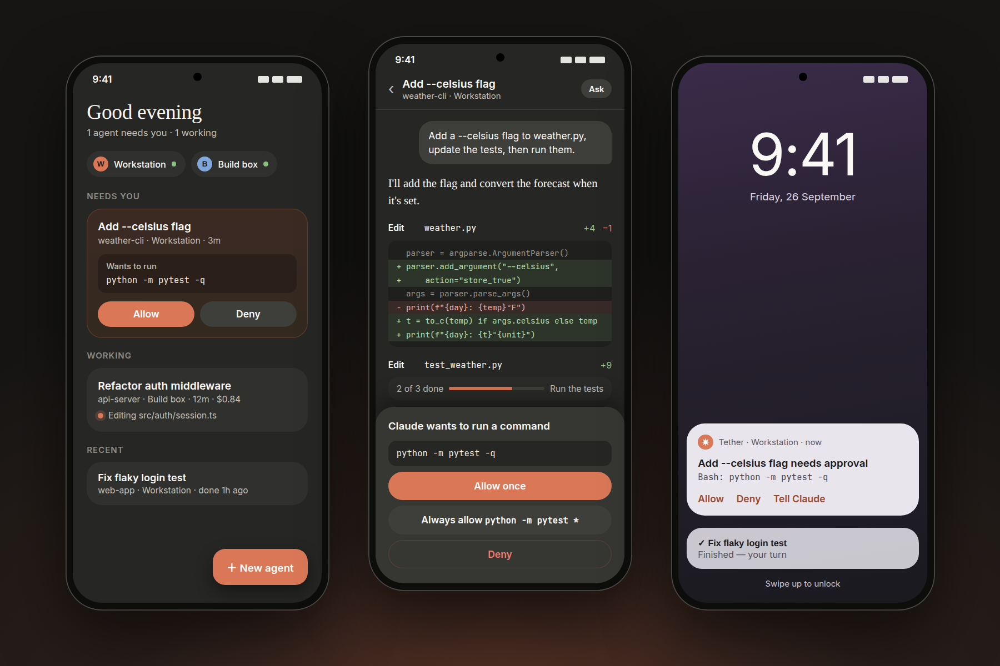
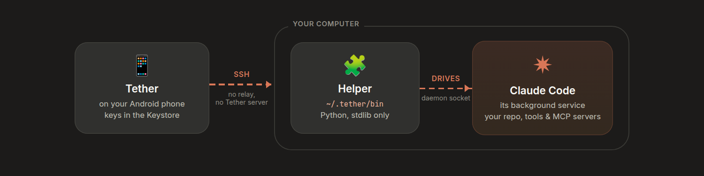

<div align="center">


# Tether

### Claude Code in your pocket.

Start Claude Code agents on your own computers, watch them work, and approve what they do, from your Android phone.

[](https://github.com/iwm911/Tether/releases/latest)
[](LICENSE)
[](#-get-started)

**[⬇️ Download the APK](https://github.com/iwm911/Tether/releases/latest)** &nbsp;·&nbsp; [🌐 Website](https://iwm911.github.io/Tether/) &nbsp;·&nbsp; [🔒 Privacy](PRIVACY.md)

<br>

<br><sub>Illustration of the app's screens</sub>

</div>

---

## 💡 The idea

You give Claude Code a big task and walk away. Ten minutes later it stops and waits:
*"Can I run `npm test`?"* It sits there until you're back at the keyboard.

**Tether sends that question to your phone.** Tap **Allow**, read the diff, or send a new instruction,
from the couch, the train, or the queue at the coffee shop. The agent keeps running on your computer,
with your files, your tools and your setup.

<table>
<tr>
<td width="33%" valign="top">

### 📲 Approve from anywhere
Permission requests show up as notifications with **Allow · Deny · Reply** buttons. No need to open
the app. The command stays hidden on the lock screen, and answering needs your phone unlocked.

</td>
<td width="33%" valign="top">

### 🖥️ Runs on your machine
Claude works in your real repo with your tools, MCP servers and private network. Tether only
connects to it over SSH.

</td>
<td width="33%" valign="top">

### 🔁 Survives anything
Agents run detached on the computer. Phone asleep, signal lost, app closed: the work carries on, and
Tether picks up where it left off.

</td>
</tr>
<tr>
<td valign="top">

### 🚀 Start from the phone
Pick a machine, browse to a folder, type a prompt. You don't need anything running on the computer
beforehand.

</td>
<td valign="top">

### 🗂️ All your machines, all your sessions
Laptop, desktop and servers on one home screen. Continue **any** past Claude Code session, including
ones you started at your desk.

</td>
<td valign="top">

### 🔓 No account, no server
Open source. Your phone talks straight to your computers. There's no Tether cloud in between.

</td>
</tr>
</table>

## 🤔 Why not Remote Control or cloud sessions?

Anthropic has two official ways to use Claude Code from a phone, and both are good:
[**Remote Control**](https://code.claude.com/docs/en/remote-control) (continue a session running on
your computer from the Claude app) and
[**cloud sessions**](https://code.claude.com/docs/en/claude-code-on-the-web) (Claude works in a VM
in Anthropic's cloud). Tether fits a different need:

| | **Tether** | Remote Control | Cloud sessions |
|---|:---:|:---:|:---:|
| Where Claude works | 🖥️ your computers | 🖥️ your computer | ☁️ Anthropic's cloud |
| Start a brand-new session from the phone | ✅ any machine, any folder | ⚠️ only if `claude remote-control` is already running there | ✅ GitHub repos |
| Keeps running with no terminal open | ✅ runs detached | ❌ the `claude` process must stay open (use tmux) | ✅ |
| Works with API keys, Bedrock, Vertex, LLM gateways | ✅ whatever your Claude Code uses | ❌ claude.ai subscription only | ❌ claude.ai subscription only |
| Your local tools, MCP servers, private network | ✅ | ✅ | ❌ cloud environment only |
| Needs GitHub | ❌ | ❌ | ✅ |
| Continue sessions you started at the desk | ✅ every session on disk | ⚠️ only ones with Remote Control on | ⚠️ via the Desktop app's hand-off |
| Connection path | phone ⇄ SSH ⇄ your computer | via Anthropic's relay | via Anthropic's cloud |
| Open source | ✅ Apache 2.0 | ❌ | ❌ |
| iPhone / browser | ❌ Android only | ✅ | ✅ |

**Use Tether** when you want your own machines, any login method, nothing pre-started, and no relay.
**Use the official apps** when you're on iOS or in a browser, or when you can't reach your computer
over SSH.

## ⚙️ How it works

<p align="center"></p>

1. Tether connects to your computer over **SSH**. Your SSH key is encrypted with a key held in the phone's secure hardware.
2. It installs a tiny helper script (`~/.tether/bin`, Python standard library only).
3. The helper starts Claude Code **in the background**, so it doesn't depend on the phone staying
   connected.
4. Tether streams the conversation to your phone and sends back your messages and approvals.

## 🚀 Get started

**You need:** an Android phone (8.0+), and a Mac or Linux computer you can SSH into with
[Claude Code](https://code.claude.com/docs/en/quickstart) and `python3` installed. Tailscale or
WireGuard works well for reaching it from outside your home network.

1. **Install.** Download the APK from [Releases](https://github.com/iwm911/Tether/releases/latest)
   and open it. Allow "Install unknown apps" when asked.
2. **Add your computer.** Enter `user@host`. Tap **New key → Install on server** to set up
   key login with your password once.
3. **Start an agent.** Tap **New agent**, pick a folder, type what you want done, and put your phone
   away. It'll tell you when Claude needs you.

Tether updates itself from GitHub Releases, and every update is verified before it installs.

## 🔒 Security & privacy

- 🔑 **Keys never leave the phone.** They're encrypted with a key held in the Android Keystore.
  Optionally, *Keys only while unlocked* makes them unreadable whenever the phone is locked.
- 📵 **Nothing to approve from the lock screen.** Approval notifications hide the command until you
  unlock, and Allow / Deny / Reply only work on an unlocked phone.
- 🔗 **Links from Claude's output are filtered.** Only web and email links open, after showing you
  the real address.
- 🛡️ **Host keys are pinned.** If a server's key changes, you get a loud warning before connecting.
- 👆 **Optional app lock** with fingerprint, face or screen lock.
- ✋ **Claude Code's permission rules still apply.** Tether passes your approvals through; it never
  bypasses them.
- 📊 **Anonymous usage stats** (app opens, agents started) via open-source
  [Aptabase](https://aptabase.com). Nothing is sent until you've seen the notice, and it's one tap to
  turn off. **Never** your machines, prompts or code. [Exactly what's sent →](PRIVACY.md)

Found a security issue? Please report it
[privately](https://github.com/iwm911/Tether/security/advisories/new).

## 📖 More

<details>
<summary><b>Full feature list</b></summary>

- **Home screen for your agents.** Agents waiting on you come first, with inline Allow / Deny; then
  running agents with live status, last message, elapsed time and cost; then recent ones.
- **A conversation, not a terminal.** Markdown replies; tool calls as quiet one-line rows that expand
  to diffs, command output and file previews.
- **Approvals.** *Allow once*, *Always allow `<rule>`* or *Deny*, optionally telling Claude what to
  do instead. Also from the notification.
- **Full control.** Stop button, permission modes (Ask → Accept edits → Plan → Auto), switch models
  mid-run, `/` slash-command autocomplete, voice dictation, image attachments, queued messages.
- **Live plans and questions.** Claude's todo list as a pinned checklist; `AskUserQuestion` as
  tappable choices.
- **Branch and retry.** Edit an earlier message and branch from it, optionally restoring files from
  Claude Code's checkpoints.
- **Past sessions.** Browse and continue every Claude Code session on each machine.
- **Native background agents.** Start and manage `claude --bg` agents too (see below).
- **Built for mobile networks.** SSH keepalives, instant reconnect on network changes, optional
  foreground service so approvals keep arriving.
- **Native design.** Jetpack Compose + Material 3, dark and light themes, dynamic colour, haptics.

</details>

<details>
<summary><b>Two kinds of agents</b></summary>

| | Live (recommended) | Background |
|---|---|---|
| Runs as | `claude -p` stream-json, driven by Tether | native `claude --bg` |
| Approve tool use from the phone | ✅ panel + notification actions | ❌ approvals happen on the computer |
| Streaming, interrupt, mode/model switch | ✅ | stop only |
| Shows in `claude agents` on the computer | — | ✅ |
| Reply | any time (queues while busy) | when it's idle/done |

</details>

<details>
<summary><b>Under the hood</b></summary>

- SSH via **sshj** + BouncyCastle; the helper is uploaded over SFTP to
  `~/.tether/bin/tether_helper.py` and re-uploaded when its version changes.
- Agents are spawned detached (`setsid`). Claude reads stream-json from
  `~/.tether/runs/<id>/in.jsonl` and writes `out.jsonl`; the app tails it from a byte offset.
- A `watch` command streams status for all runs plus a heartbeat to detect dead links.
- Past sessions come from Claude Code's own transcripts in `~/.claude/projects`.
- Secrets: AES-256-GCM with a key generated inside the Android Keystore. Android backup and device
  transfer are disabled.

Architecture and protocol notes: [`docs/SPEC.md`](docs/SPEC.md).

</details>

<details>
<summary><b>Build from source</b></summary>

```bash
export ANDROID_HOME=~/Android/Sdk
./gradlew :app:testDebugUnitTest :app:assembleRelease    # → app/build/outputs/apk/release/
```

Needs JDK 17+ and the Android SDK, on a local disk (not a network share). For signed release builds,
put `keystore.properties` (storeFile, storePassword, keyAlias, keyPassword) and the keystore in the
project root; both are gitignored.

| Gradle property | Purpose |
|---|---|
| `-PtetherUpdateRepo=owner/name` | Repo the in-app updater follows (default `iwm911/Tether`) |
| `-PtetherAptabaseKey=…` | Aptabase app key; unset = no analytics at all |
| `-PtetherVersionCode=N` / `-PtetherVersionName=X.Y.Z` | Override the version |

</details>

<details>
<summary><b>Publishing a release</b></summary>

```bash
tools/publish_update.sh release --code N --name X.Y.Z --notes "What's new"
```

Builds the signed APK and creates GitHub release `vX.Y.Z` on the current pushed commit, with the APK
and an `update.json` manifest (version code + SHA-256). Needs the `gh` CLI and `keystore.properties`.
Installed apps offer the update on their next check. `tools/publish_update.sh debug` publishes a
pre-release that only debug builds pick up.

</details>

## 🤝 Contributing

Issues and pull requests are welcome. See [CONTRIBUTING.md](CONTRIBUTING.md).

## 📄 License

[Apache License 2.0](LICENSE). Tether is an independent project, not affiliated with or endorsed by
Anthropic.
